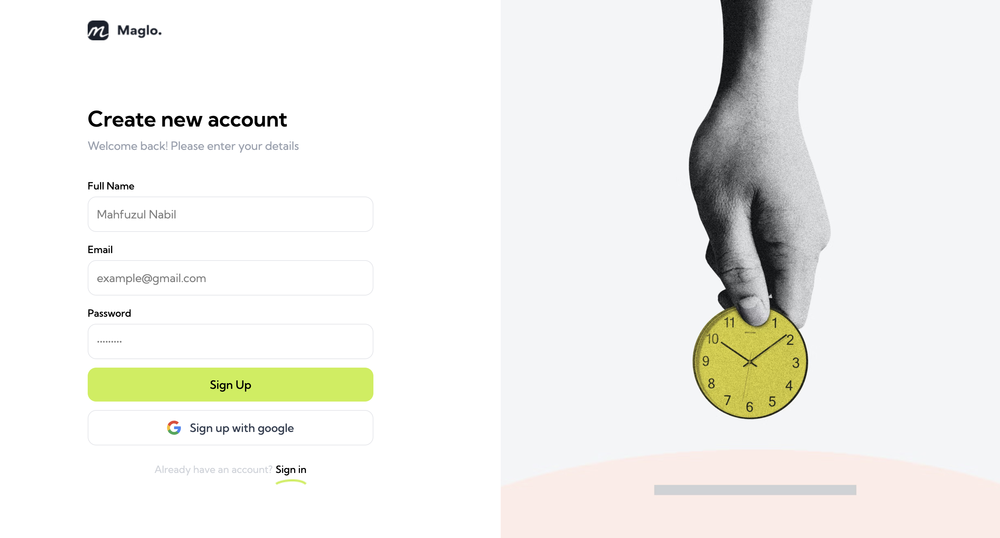
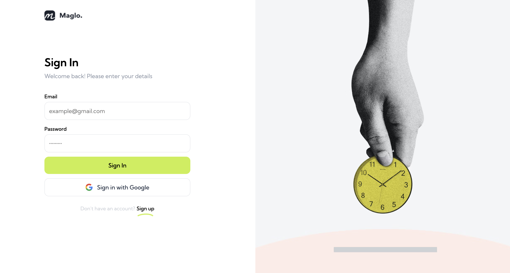
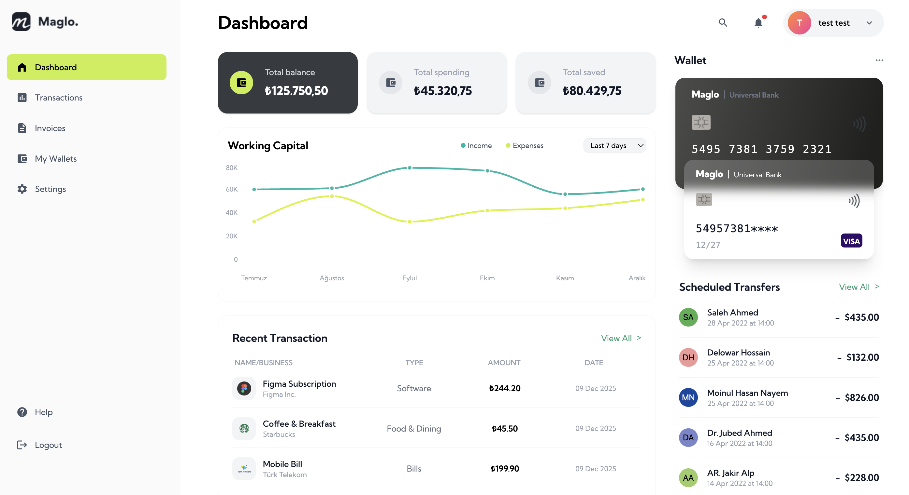

# Maglo Finance Dashboard

Maglo is a desktop-first finance dashboard where users can track their balances, recent transactions, working capital analytics, and scheduled transfers.
This project was built as a front-end case study and focuses on clean architecture, reusable components, and modern React practices.

## 🚀 Tech Stack
- React + Vite
- Tailwind CSS
- Zustand (Global Auth Store)
- React Query (API State / Caching)
- Recharts (Working Capital Chart)
- React Icons

---

## 🧩 Features
- Authentication (Sign In)
- Dashboard overview (Stats, Chart, Transactions)
- Wallet card UI (with glassmorphism + layered cards)
- Scheduled transfers list
- Fully responsive (desktop-first design)
- Reusable and isolated UI components
- Centralized API client + service + hook architecture

---

## 🛠️ Setup & Run
```bash
# Install
npm install

# Start dev server
npm run dev

# Build
npm run build
```
- The project runs at: http://localhost:5173

## 📸 Screen Shots
- Sign Up:
  


- Sign In:
  


- Dashboard:
  

